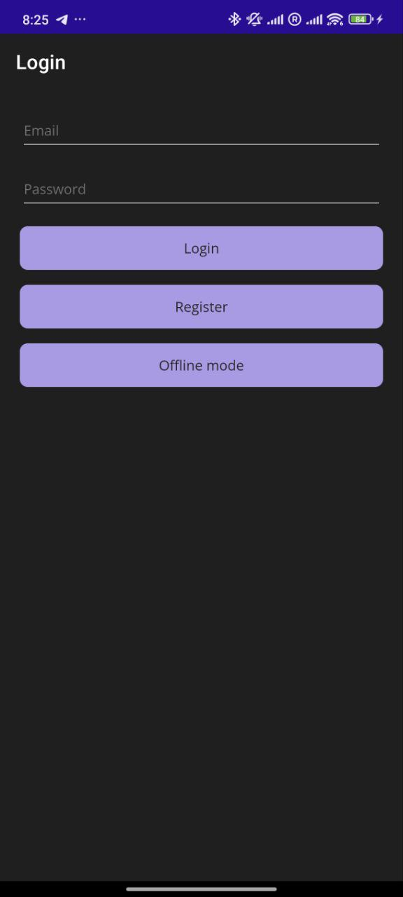
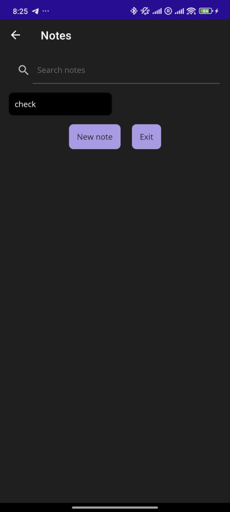
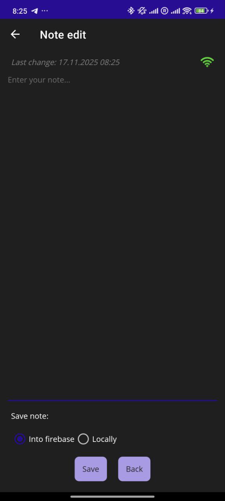

# CloudNotesApp ☁️📝

Кроссплатформенное мобильное приложение на **.NET MAUI** для создания и хранения заметок.

Главная особенность проекта — **гибридная система хранения**. Пользователь сам решает, где хранить каждую конкретную заметку: только на устройстве (локально) или синхронизировать её с облаком (Firebase).

## 🚀 Функционал

* **Аутентификация:** Регистрация и вход пользователей через Email/Пароль (Firebase Authentication).
* **Гибридное хранение:**
    * 📁 **Локально:** Заметки сохраняются в JSON-файл на устройстве. Доступны всегда, даже без интернета.
    * ☁️ **Облако:** Заметки сохраняются в Firebase Realtime Database. Доступны с любого устройства после входа.
* **Визуальная индикация:**
    * 🟩 Зеленый фон: Заметка в облаке.
    * ⬛ Черный/Серый фон: Локальная заметка.
* **Offline-режим:** Возможность использовать приложение без входа в аккаунт (только локальное хранение).
* **Индикатор сети:** Отображение статуса подключения к интернету в реальном времени.
* **Поиск:** Фильтрация заметок по содержимому.

## 🛠 Технологический стек

* **Платформа:** .NET 8 MAUI (Android, iOS, Windows, Mac).
* **Язык:** C#, XAML.
* **Архитектура:** Code-Behind / Services.
* **Backend:** Firebase (используется **REST API** напрямую через `HttpClient`).
* **Данные:**
    * `System.Text.Json` для сериализации.
    * Firebase Realtime Database для облака.
    * Локальная файловая система (`FileSystem.AppDataDirectory`) для оффлайн-заметок.

## 📂 Структура проекта

* `Views/` — Страницы приложения (Login, Registration, NotesList, NoteEdit).
* `Services/` — Логика работы с данными:
    * `FirebaseService.cs` — Взаимодействие с Firebase Auth и Database через REST API.
    * `LocalNoteService.cs` — Чтение и запись локального `notes.json`.
* `Models/` — Описание сущностей `User` и `Note`.

## ⚙️ Настройка и запуск

1.  **Клонируйте репозиторий:**
    ```bash
    git clone [https://github.com/ваше-имя-пользователя/CloudNotesApp.git](https://github.com/ваше-имя-пользователя/CloudNotesApp.git)
    ```
2.  **Настройка Firebase:**
    * В файле `Services/FirebaseConfig.cs` необходимо указать ваши ключи от проекта Firebase:
    ```csharp
    public static class FirebaseConfig
    {
        public static string ApiKey = "ВАШ_API_KEY";
        public static string DatabaseUrl = "ВАШ_URL_БАЗЫ_ДАННЫХ";
    }
    ```
    > **Примечание:** Для работы авторизации в консоли Firebase должен быть включен метод входа "Email/Password", а для базы данных Realtime Database — настроены правила чтения/записи.

3.  **Запуск:**
    * Откройте проект в Visual Studio 2022.
    * Выберите целевую платформу (например, Android Emulator или Windows Machine).
    * Нажмите Play ▶️.

## 📸 Скриншоты

| Экран входа | Список заметок | Редактирование |
|:---:|:---:|:---:|
|  |  |  |

## 🔮 Планы по улучшению

* [ ] Внедрение архитектуры MVVM (CommunityToolkit.Mvvm).
* [ ] Внедрение Dependency Injection для сервисов.
* [ ] Шифрование локальных заметок.
* [ ] Улучшение дизайна UI/UX.

---
Автор: [Ваше Имя]
